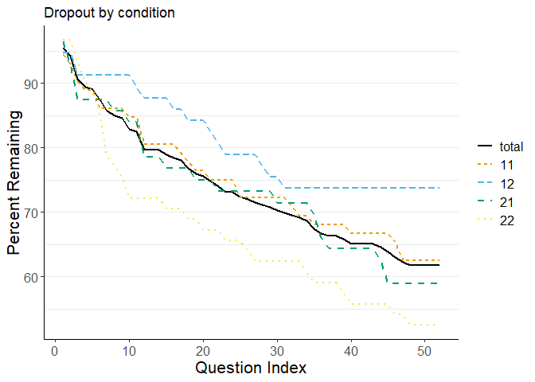

<!-- README.md is generated from README.Rmd. Please edit this file -->

# dropR: An R Package for Dropout Analysis

<!-- badges: start -->
<!-- badges: end -->

## Installation

You can install the development version of dropR from
[GitHub](https://github.com/) with:

``` r
# install.packages("remotes")
remotes::install_github("iscience-kn/dropR")
```

We are currently working to get `dropR` back on CRAN. Once it’s up
again, you can install dropR via

``` r
install.packages("dropR")
```

## Usage as a Shiny App (Graphical User Interface)

To start `dropR's` built-in GUI, run

``` r
dropR::start_app()
```

## Interactive Usage (use dropR on the R Console)

You can also use dropR’s functionality within R, i.e., either on the
console or within your own functions and packages. Read more about
interactive usage of dropR in our [walkthrough
article](articles/interactive.html).

    #> 
    #> Welcome to dropR,
    #> to start the interactive Graphical User Interface locally in your R session,
    #> run start_app()

<!--  -->

``` r
library(dropR)
#> 
#> Welcome to dropR,
#> to start the interactive Graphical User Interface locally in your R session,
#> run start_app()
df <- add_dropout_idx(dropRdemo, 3:54)
stats <- compute_stats(df,
                       by_cond = "experimental_condition",
                       no_of_vars = 52)
plot_do_curve(stats, full_scale = F) + ggplot2::labs(title = "Dropout by condition")
```


