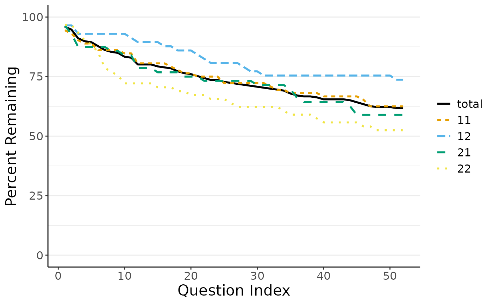
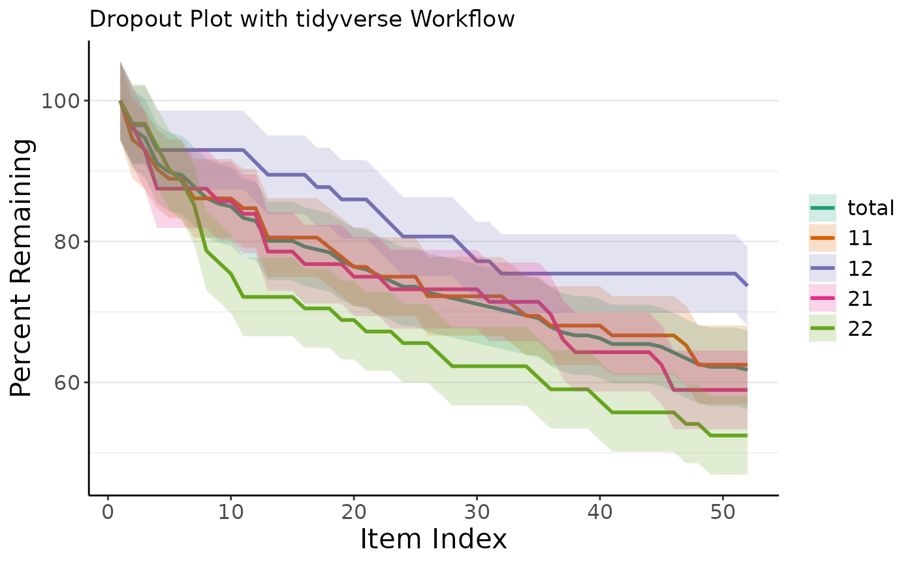

# Interactive Dropout Analysis with dropR

``` r
library(dropR)
```

Though the low-hurdle of the online version with its graphical user
interface (GUI) is appealing for many use cases, there are good reasons
to directly use dropR’s backend in the R console without the GUI: Some
data.frames may need extra formatting or additional cleaning before they
suit the dropR input format or you may want adapt and extend your
analysis in a way the GUI does not allow to. If you are writing a report
directly in RMarkdown, you can also make use of automatically reporting
your results in your document or embedding a dropout plot from dropR.

## Dropout Analysis Walkthrough

This section describes how to extract information on dropout from the
demo data set without using the dropR shiny UI. First, let’s make sure
the demo data set is loaded and available. The data set should look like
this:

``` r
library(dropR)
# Use demo dataset in a new data frame to be edited
df <- dropRdemo
```

| obs_id | experimental_condition | vi_1 | vi_2 | vi_3 | …   | vi_51 | vi_52 |
|:-------|-----------------------:|-----:|-----:|-----:|:----|------:|------:|
| 7a9f33 |                     11 |    1 |    1 |    1 |     |     1 |     1 |
| e11f94 |                     22 |    1 |   NA |    1 |     |    NA |    NA |
| e72a50 |                     22 |    1 |   NA |    1 |     |     1 |     1 |
| f90f5f |                     11 |    1 |    1 |    1 |     |     1 |     1 |
| 20bc72 |                     12 |    1 |   NA |    1 |     |     1 |     1 |

### Basic Dropout Statistics

Now, let’s extract dropout, i.e., information on when a participant
dropped out of the questionnaire and never returned. For this, we need
to identify the last question that someone filled out before only
missing data is present a.k.a `NA`s. We will use the `add_dropout_idx`
function on the demo data set and add the position of all question
variables in the data. In the demo data, questions are easily identified
by their prefix `vi_`:

``` r
qs <- which(grepl("vi_", names(df)))
# add numeric drop out position to original dataset
df <- add_dropout_idx(df, q_pos = qs)
kable(head(df[,c(1:3,(ncol(df)-1):ncol(df))]))
```

| obs_id | experimental_condition | vi_1 | vi_52 | do_idx |
|:-------|-----------------------:|-----:|------:|-------:|
| 7a9f33 |                     11 |    1 |     1 |     53 |
| e11f94 |                     22 |    1 |    NA |      6 |
| e72a50 |                     22 |    1 |     1 |     53 |
| f90f5f |                     11 |    1 |     1 |     53 |
| 20bc72 |                     12 |    1 |     1 |     53 |
| 76b97a |                     22 |    1 |    NA |     27 |

The `experimental_condition` column indicates belonging to a sub sample,
each of which was treated differently. For example, groups receive a
different sequence of questions or different wording.

Next we’ll compute a table containing basic dropout statistics for each
item using the `compute_stats` function.

``` r
stats <- compute_stats(df,
                       by_cond = "experimental_condition",
                       no_of_vars = length(qs))
kable(head(stats))
```

| q_idx | condition |  cs |   N | remain | pct_remain |
|------:|:----------|----:|----:|-------:|-----------:|
|     1 | total     |   0 | 246 |    246 |  1.0000000 |
|     2 | total     |  10 | 246 |    236 |  0.9593496 |
|     3 | total     |  13 | 246 |    233 |  0.9471545 |
|     4 | total     |  22 | 246 |    224 |  0.9105691 |
|     5 | total     |  25 | 246 |    221 |  0.8983740 |
|     6 | total     |  26 | 246 |    220 |  0.8943089 |

Out of 246 participants in total in the demo sample, 246 participants
remain in the survey at the first question, accounting for 100 percent
of the sample. At the last question of the experiment, 61.79% of all
participants “survived”. The `cs` column shows the absolute cumulative
dropout count.

The stats table shows the dropout statistics for the total sample first
and if defined in the function `by_cond`, it also shows the same
statistics for each experimental condition separately. This table is the
basis for many further analyses and can easily be reported.

### Plotting Dropout Curves

Based on the above statistics table, dropR plots dropout curves very
conveniently.

``` r
plot_do_curve(stats)
```



By default, the function to plot dropout curves chooses a color palette
which is designed to be distinguishable for color blind individuals.
Adhering to some journal guidelines, you may also choose a gray color
palette, distinguishing the lines by line type and gray value.

## Full Workflow Example using `tidyverse`

To wrap up this walkthrough, we want to show you a full analysis example
in just six lines of code using `tidyverse` workflow with functions from
`magrittr` and `ggplot2`. Specifically, it is very easy to `pipe`
several dropR functions to create the full analysis as well as plotting
all at once. Moreover, it is easy to customize the plot further using
common `ggplot2` functions as shown. Assuming we want to create a
similar analysis as before with a customized plot output, we can achieve
this like so:

``` r
library(ggplot2)

dropRdemo |>  
  add_dropout_idx(3:54) |> 
  compute_stats(by_cond = "experimental_condition", no_of_vars = 52) |>  
  plot_do_curve(linetypes = F, full_scale = F, show_confbands = T) +
  labs(title = "Dropout Plot with tidyverse Workflow") +
  scale_color_brewer(palette = "Dark2") + scale_fill_brewer(palette = "Dark2")
#> Scale for colour is already present.
#> Adding another scale for colour, which will replace the existing scale.
#> Scale for fill is already present.
#> Adding another scale for fill, which will replace the existing scale.
```



Next, you may want to run more statistical dropout analyses using
`dropR`. You can find an in-depth tutorial in our [test
article](https://iscience-kn.github.io/dropR/articles/tests.html).

## Reporting dropout

As of package version 1.0.4 you can also use the
[`do_print()`](https://iscience-kn.github.io/dropR/reference/do_print.md)
function to report dropout: Either as a nicely formatted console output,
as a string object or as a prepared markdown object (e.g. for use in
RMarkdown or Quarto documents).

``` r
do_print(stats)
#> [1] "dropout up to item 52: total=38.2%, 11=37.5%, 12=26.3%, 21=41.1%, 22=47.5%."
```

This can be used with inline code (`as_markdown = TRUE` is recommended)
to produce the following output: **dropout** up to item 52: dropout up
to item 52: total=38.2%, 11=37.5%, 12=26.3%, 21=41.1%, 22=47.5%..

It can also handle results from Chi-Squared analysis of dropout:

``` r
chi <- do_chisq(stats, p_sim = T) # automatically compares all conditions up to the last item
do_print(chi)
#> [1] "item 52: X^2(df NA) = 5.87, p = 0.112; dropout: 11=37.5%, 12=26.3%, 21=41.1%, 22=47.5%."
```

In an RMarkdown or Quarto document the output is formatted like so:
$\chi^{2}$(df NA) = 5.87 *p* = 0.112; **dropout**: 11=37.5%, 12=26.3%,
21=41.1%, 22=47.5%.
