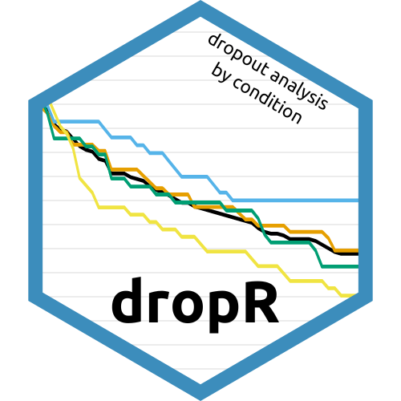

# dropR: Dropout Analysis by Condition [](https://iscience-kn.github.io/dropR/)

## Installation

You can install the development version of `dropR` from
[GitHub](https://github.com/iscience-kn/dropR) with:

``` r
# install.packages("remotes")
remotes::install_github("iscience-kn/dropR")
```

We are currently working to get `dropR` back on CRAN. Once it’s up
again, you can install `dropR` via

``` r
install.packages("dropR")
```

## Usage as a Shiny App (Graphical User Interface)

To start `dropR`’s built-in GUI, run

``` r
dropR::start_app()
```

or visit the [dropR Web App](https://iscience-kn.shinyapps.io/dropR/).

## Interactive Usage (use dropR on the R Console)

You can also use `dropR`’s functionality within R, i.e., either in the
console or within your own functions and packages. Read more about
interactive usage of `dropR` in our [walkthrough
article](https://iscience-kn.github.io/dropR/articles/interactive.html).


Fig. 1: dropR Example Plot from
[`plot_do_curve()`](https://iscience-kn.github.io/dropR/reference/plot_do_curve.md).

## Reference

Reips, U.-D., Overlander, A. T., & Bannert, M. (2025). Dropout analysis:
A method for data from Internet-based research and dropR, an R-based web
app and package to analyze and visualize dropout. *Behavior Research
Methods, 57*(8), 231. <https://doi.org/10.3758/s13428-025-02730-2>.
